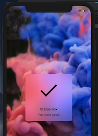

# VSAlertModalStatus
> Show iOS status alert boxes using one line of code

[![Swift Version][swift-image]][swift-url]
[![Build Status][travis-image]][travis-url]
[![License][license-image]][license-url]
[](https://img.shields.io/cocoapods/v/LFAlertController.svg)  
[](http://cocoapods.org/pods/LFAlertController)
[](http://makeapullrequest.com)

VSAlertModalStatus allows you to show alerts containing in image, title, and subtitle, which is animated in and shown for a few seconds until it automatically fades out. This framework aims to replicate the same look and feel as the status alert boxes used on the iOS Music app. 



## Features

- [x] Show an alert box using one line of code

## Requirements

- iOS 11.0+
- Xcode 10.0

## Installation

#### CocoaPods
You can use [CocoaPods](http://cocoapods.org/) to install `YourLibrary` by adding it to your `Podfile`:

```ruby
pod 'VSAlertModalStatus', :git => 'https://github.com/vioside/VSAlertModalStatus', :tag => '0.0.3'
```

To get the full benefits import `YourLibrary` wherever you import UIKit

``` swift
import UIKit
import VSAlertModalStatus
```

## Usage example

```swift
import VSAlertModalStatus
VSModalStatusView.displayAlertStatusIn(controller: self,
                                               image: UIImage(named: "test")!,
                                               title: "Static",
                                               subtitle: "",
                                               duration: 0.10)
```

## Contribute

We would love you for the contribution to VSAlertModalStatus, check the ``LICENSE`` file for more info.

## Meta

Vioside – [@Vioside](https://twitter.com/vioside) 

Distributed under the MIT license. See ``LICENSE`` for more information.

[https://github.com/vioside/VSAlertModalStatus](https://github.com/vioside/VSAlertModalStatus)

[swift-image]:https://img.shields.io/badge/swift-4.0-green.svg
[swift-url]: https://swift.org/
[license-image]: https://img.shields.io/badge/License-MIT-blue.svg
[license-url]: LICENSE
[travis-image]: https://img.shields.io/travis/dbader/node-datadog-metrics/master.svg?style=flat-square
[travis-url]: https://travis-ci.org/dbader/node-datadog-metrics
[codebeat-image]: https://codebeat.co/badges/c19b47ea-2f9d-45df-8458-b2d952fe9dad
[codebeat-url]: https://codebeat.co/projects/github-com-vsouza-awesomeios-com
